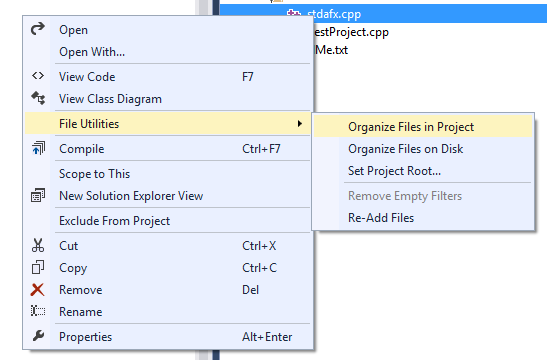

# VC File Utilities

* Use `Set Project Root...` to define the path which should be treated as the root source directory. This setting is stored in a file called `vc-fileutils.settings` which is placed in the directory of the project file.
* Use `Organize Files in Project` to move the selected files inside the project structure according to the file path relative to the selected root directory. Any missing filters will be generated.
* Use `Organize Files on Disk` to move the selected files on the file system according to the relative path inside the project and the specified root directory.
* Use `Remove Empty Filters` to recursively remove empty filters in the selected filters.
* Use `Re-Add Files` to recursively remove all files and add them again (this is useful for me when developing with the Qt add-in where sometimes the moc files are not generated properly).
